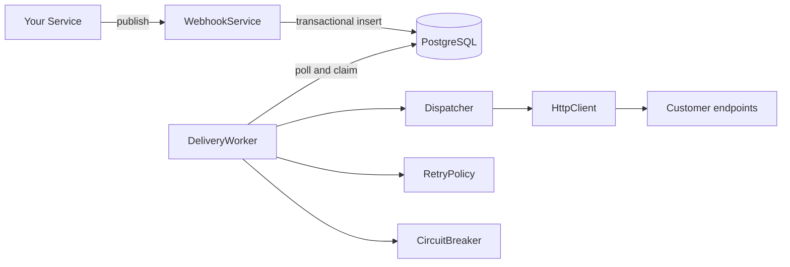

# @nestarc/webhook

Outbound webhook delivery for NestJS — HMAC signing, exponential retry, circuit breaker, delivery logs, fan-out, [Standard Webhooks](https://www.standardwebhooks.com/) compatible.

**No separate infrastructure required.** Uses your existing PostgreSQL database.

[](https://github.com/nestarc/webhook/actions/workflows/ci.yml)

[Changelog](./CHANGELOG.md) · [Security policy](./SECURITY.md)

> **Pre-1.0:** minor version bumps may include breaking changes. Pin exact versions in production until `1.0.0`.

## Features

- **Fan-out delivery** — one event to many endpoints
- **HMAC-SHA256 signing** — Standard Webhooks compatible headers
- **Secret rotation overlap** — sign with both old and new secrets during rotation windows
- **Exponential backoff** — 30s, 5m, 30m, 2h, 24h (with jitter)
- **Circuit breaker** — auto-disable failing endpoints, auto-recover after cooldown
- **Dead letter queue** — failed deliveries tracked for manual retry
- **Delivery logs** — full audit trail (status code, latency, response body)
- **Per-attempt audit log** — every attempt recorded with status, latency, response body, and errors
- **Endpoint snapshotting** — queued deliveries keep their original URL and signing secret during retries
- **Multi-instance safe** — `FOR UPDATE SKIP LOCKED` prevents duplicate delivery
- **Graceful shutdown** — waits for in-flight deliveries on process exit
- **SSRF defense** — DNS resolution validation at registration and dispatch time
- **Ports/adapters architecture** — swap Prisma or fetch with custom implementations
- **Stale delivery recovery** — lease-based reaper recovers crashed worker deliveries
- **Notification hooks** — retry, degraded, failed, and disabled callbacks for observability and alerting

## Installation

```bash
npm install @nestarc/webhook
```

**Peer dependencies:**

```bash
npm install @nestjs/common @nestjs/core @nestjs/schedule @prisma/client
```

## Database Setup

Run the migration SQL against your PostgreSQL database:

```bash
psql -d your_database -f node_modules/@nestarc/webhook/src/sql/create-webhook-tables.sql
```

This creates four tables: `webhook_endpoints`, `webhook_events`, `webhook_deliveries`, and `webhook_delivery_attempts`.

The migration includes `CREATE EXTENSION IF NOT EXISTS pgcrypto` for PostgreSQL < 13 compatibility.

### Upgrading from versions before 0.9.0

Existing databases need the v0.9.0 additive migration for per-attempt audit logs, endpoint snapshots, and secret rotation overlap:

```bash
psql -d your_database -f node_modules/@nestarc/webhook/src/sql/migrations/v0.9.0.sql
```

See [CHANGELOG.md](./CHANGELOG.md) for release-specific migration notes.

## Quick Start

### 1. Register the module

```typescript
import { WebhookModule } from '@nestarc/webhook';

@Module({
  imports: [
    WebhookModule.forRoot({
      // prismaService is your PrismaClient/PrismaService instance.
      // See "Async configuration" below for NestJS DI wiring.
      prisma: prismaService,
      delivery: {
        timeout: 30_000,
        maxRetries: 6,
        jitter: true,
      },
      circuitBreaker: {
        degradedThreshold: 3,
        failureThreshold: 5,
        cooldownMinutes: 60,
      },
      polling: {
        interval: 5000,
        batchSize: 50,
      },
      onDeliveryRetryScheduled: (ctx) => {
        // Internal observability: a retry was persisted with ctx.nextAttemptAt.
      },
      onEndpointDegraded: (ctx) => {
        // Alert candidate: endpoint reached the degraded threshold before disablement.
      },
      onDeliveryFailed: (ctx) => {
        // Terminal delivery failure only.
      },
      onEndpointDisabled: (ctx) => {
        // Endpoint transitioned from active to inactive.
      },
    }),
  ],
})
export class AppModule {}
```

### 2. Define events

```typescript
import { WebhookEvent } from '@nestarc/webhook';

export class OrderCreatedEvent extends WebhookEvent {
  static readonly eventType = 'order.created';

  constructor(
    public readonly orderId: string,
    public readonly total: number,
  ) {
    super();
  }
}
```

> **Note:** Subclasses **must** define `static readonly eventType`. The module throws at runtime if this is missing.

### 3. Send events

```typescript
import { WebhookService } from '@nestarc/webhook';

@Injectable()
export class OrderService {
  constructor(private readonly webhooks: WebhookService) {}

  async createOrder(dto: CreateOrderDto) {
    const order = await this.saveOrder(dto);
    await this.webhooks.send(new OrderCreatedEvent(order.id, order.total));
    return order;
  }
}
```

### 4. Manage endpoints

```typescript
import { WebhookEndpointAdminService } from '@nestarc/webhook';

@Injectable()
export class WebhookController {
  constructor(private readonly endpointAdmin: WebhookEndpointAdminService) {}

  async register() {
    // Secret is returned only on creation
    return this.endpointAdmin.createEndpoint({
      url: 'https://customer.com/webhooks',
      events: ['order.created', 'order.paid'],
      tenantId: 'tenant_123', // optional; omit for global endpoints (returned as null)
      secret: 'auto', // case-sensitive; omit or pass "auto" to generate a secret
    });
  }
}
```

## API Reference

### WebhookService

| Method | Description |
|--------|-------------|
| `send(event)` | Publish event to all matching endpoints |
| `sendToTenant(tenantId, event)` | Publish to tenant-specific endpoints only |
| `sendToEndpoints(endpointIds, event)` | Publish to specific endpoint IDs only |

### WebhookEndpointAdminService

| Method | Description |
|--------|-------------|
| `createEndpoint(dto)` | Register a new webhook endpoint (returns secret) |
| `listEndpoints(tenantId?)` | List all endpoints (secret excluded) |
| `getEndpoint(id)` | Get endpoint details (secret excluded) |
| `updateEndpoint(id, dto)` | Update endpoint URL, events, description, metadata, or active status |
| `rotateSecret(endpointId, dto)` | Rotate the endpoint signing secret and keep the previous secret valid until `previousSecretExpiresAt` |
| `deleteEndpoint(id)` | Delete an endpoint |
| `sendTestEvent(endpointId)` | Send a `webhook.test` ping event |

### WebhookDeliveryAdminService

| Method | Description |
|--------|-------------|
| `getDeliveryLogs(endpointId, filters?)` | Query delivery history |
| `getDeliveryAttempts(deliveryId)` | Query per-attempt audit records for a delivery |
| `retryDelivery(deliveryId)` | Manually retry a failed delivery |

### WebhookSigner

| Method | Description |
|--------|-------------|
| `sign(eventId, timestamp, body, secret)` | Generate Standard Webhooks signature headers |
| `signAll(eventId, timestamp, body, secrets[])` | Generate multi-signature headers for secret rotation overlap |
| `verify(eventId, timestamp, body, secret, signature)` | Verify a webhook signature |
| `generateSecret()` | Generate a random base64 signing secret |

> **Deprecated:** `WebhookAdminService` is a facade that delegates to `WebhookEndpointAdminService` and `WebhookDeliveryAdminService`. It has been deprecated since `v0.2.0` and will be removed in `v1.0.0`.

## Configuration

| Option | Default | Description |
|--------|---------|-------------|
| `prisma` | — | PrismaClient instance (required unless all custom repos provided) |
| `delivery.timeout` | `10000` | HTTP request timeout (ms) |
| `delivery.maxRetries` | `5` | Maximum delivery attempts |
| `delivery.jitter` | `true` | Add random jitter to retry delays |
| `circuitBreaker.failureThreshold` | `5` | Consecutive failures before disabling endpoint |
| `circuitBreaker.degradedThreshold` | — | Consecutive failures before firing `onEndpointDegraded`. Disabled unless configured. Must be lower than `failureThreshold`. |
| `circuitBreaker.cooldownMinutes` | `60` | Minutes before attempting recovery |
| `polling.enabled` | `true` | Set to `false` to disable the polling loop (API-only mode) |
| `polling.interval` | `5000` | Delivery worker poll interval (ms) |
| `polling.batchSize` | `50` | Max rows claimed in one database claim |
| `polling.staleSendingMinutes` | `5` | Minutes before a stuck SENDING delivery is recovered |
| `polling.maxConcurrency` | `polling.batchSize` | Max delivery dispatches in flight per worker process |
| `polling.drainWhileBacklogged` | `false` | Keep claiming additional batches inside one poll while backlog and capacity remain |
| `polling.maxDrainLoopsPerPoll` | `1`, or `10` when drain mode is enabled | Max claim loops inside one poll cycle |
| `polling.drainLoopDelayMs` | `0` | Optional delay between drain loops |
| `allowPrivateUrls` | `false` | Allow private/internal URLs (dev/test only) |
| `secretVault` | `PlaintextSecretVault` | Custom vault for encrypting/decrypting endpoint secrets at rest |
| `onDeliveryFailed` | — | Fire-and-forget callback when a delivery exhausts retries or receives a non-retryable response. Receives `DeliveryFailedContext` (`tenantId` is `null` for global endpoints). See **Delivery failure classification** below. |
| `onDeliveryRetryScheduled` | — | Fire-and-forget callback after a retriable failed attempt is persisted with `nextAttemptAt`. Receives `DeliveryRetryScheduledContext`. Does not fire for terminal failures. |
| `onEndpointDegraded` | — | Fire-and-forget callback when consecutive failures reach `circuitBreaker.degradedThreshold` before endpoint disablement. Receives `EndpointDegradedContext`. |
| `onEndpointDisabled` | — | Fire-and-forget callback when the circuit breaker disables an endpoint. Fires only on active-to-inactive transition after failures meet or exceed `failureThreshold`. |

The retry schedule is fixed exponential (`30s`, `5m`, `30m`, `2h`, `24h`). Use `delivery.jitter` to enable or disable random jitter.

### Worker Capacity And Observer Metrics

The delivery worker keeps the previous default behavior: one poll claims up to `polling.batchSize` rows and waits for those deliveries before the next interval. Set `polling.maxConcurrency` to cap in-flight dispatches below or above a claim size, and set `polling.drainWhileBacklogged: true` when a worker should continue draining queued deliveries inside the same poll cycle.

```ts
WebhookModule.forRoot({
  prisma,
  polling: {
    interval: 1_000,
    batchSize: 100,
    maxConcurrency: 200,
    drainWhileBacklogged: true,
    maxDrainLoopsPerPoll: 10,
  },
  workerObserver: {
    onPollComplete(result) {
      metrics.count('webhook.worker.claimed', result.claimed);
      metrics.count('webhook.worker.sent', result.sent);
      metrics.count('webhook.worker.retried', result.retried);
      metrics.gauge('webhook.worker.poll.duration_ms', result.durationMs);
    },
    onDeliveryComplete(result) {
      metrics.count(`webhook.delivery.${result.status}`, 1);
    },
    onPollError(error) {
      logger.error({ error }, 'webhook worker poll failed');
    },
  },
});
```

Observer callbacks are best-effort. Exceptions thrown by observer callbacks are logged and do not fail delivery processing.

Backlog diagnostics are available on repository implementations that support `getBacklogSummary()`:

```ts
const summary = await deliveryRepository.getBacklogSummary?.();
```

The summary includes `pendingCount`, `sendingCount`, `runnablePendingCount`, `oldestPendingAgeMs`, and `oldestRunnableAgeMs`.

Webhook receiver responses are classified before scheduling another attempt:

| Response | Behavior |
|---|---|
| `2xx` | Mark delivery `SENT` |
| `3xx` | Retry while attempts remain |
| `408`, `409`, `425`, `429` | Retry while attempts remain |
| Other `4xx` | Mark delivery `FAILED` after the current attempt |
| `5xx` | Retry while attempts remain |
| Network, DNS, timeout, or dispatch error | Retry while attempts remain |

Permanent `4xx` failures still record the response status/body, append a failed attempt log, count as a circuit-breaker failure, clear `nextAttemptAt`, and trigger `onDeliveryFailed`.

**Delivery failure classification.** `DeliveryFailedContext.failureKind` categorizes why a delivery was abandoned after retries are exhausted or a non-retryable receiver response is observed:

| `failureKind` | When | Extra fields |
|---|---|---|
| `url_validation` | SSRF defense rejected the URL (private, loopback, link-local, etc.) | `validationReason`, `validationUrl`, `resolvedIp` |
| `dispatch_error` | Dispatcher threw (DNS failure, ECONNREFUSED, timeout) | — |
| `http_error` | Endpoint responded with non-2xx status | `responseStatus` |

Retryable HTTP responses only trigger `onDeliveryFailed` after the attempt budget is exhausted. Non-retryable receiver responses trigger it after the current attempt. Callback errors are logged and never change persisted delivery state.

`onDeliveryRetryScheduled` fires earlier, after a retryable failed attempt has been persisted with its next attempt time. It is intended for internal observability and includes the same failure classification fields as `DeliveryFailedContext`, plus `nextAttemptAt`.

`onEndpointDegraded` fires only when `circuitBreaker.degradedThreshold` is configured, the endpoint is still active, and the consecutive failure count exactly reaches that degraded threshold. It does not replace `onEndpointDisabled`, which still fires only when the endpoint transitions from active to inactive at `failureThreshold`.

```ts
onDeliveryFailed: (ctx) => {
  if (ctx.failureKind === 'url_validation') {
    // ctx.validationReason: 'private' | 'loopback' | 'link_local' | ...
    alerting.endpointMisconfigured(ctx.endpointId, ctx.validationReason);
  } else if (ctx.failureKind === 'http_error') {
    alerting.downstreamUnhealthy(ctx.endpointId, ctx.responseStatus);
  }
}
```

### Custom adapters

Replace default Prisma or fetch implementations by providing custom ports:

```typescript
WebhookModule.forRoot({
  prisma: prismaService,
  httpClient: myCustomHttpClient,          // implements WebhookHttpClient
  eventRepository: myCustomEventRepo,      // implements WebhookEventRepository
  endpointRepository: myCustomEndpointRepo,// implements WebhookEndpointRepository
  deliveryRepository: myCustomDeliveryRepo,// implements WebhookDeliveryRepository
  secretVault: myCustomVault,              // implements WebhookSecretVault
});
```

### Async configuration

```typescript
WebhookModule.forRootAsync({
  imports: [ConfigModule],
  useFactory: (config: ConfigService, prisma: PrismaService) => ({
    prisma,
    delivery: {
      maxRetries: config.get('WEBHOOK_MAX_RETRIES', 5),
    },
  }),
  inject: [ConfigService, PrismaService],
});
```

## Security

### Signing

All webhooks are signed with **HMAC-SHA256** using [Standard Webhooks](https://www.standardwebhooks.com/) headers:

```
webhook-id: <event-uuid>
webhook-timestamp: <unix-seconds>
webhook-signature: v1,<base64-hmac-sha256>
```

**Secret format:** Secrets must be valid base64 strings decoding to at least 16 bytes. Use `"auto"` (case-sensitive) or omit `secret` for automatic generation.

### SSRF defense

- Endpoint URLs are validated at **registration** and at **every dispatch**
- Blocks: private IPs, loopback, link-local, cloud metadata (169.254.x), IPv4-mapped IPv6
- DNS resolution is checked to prevent rebinding attacks
- HTTP redirects are disabled (`redirect: 'manual'`)
- Use `allowPrivateUrls: true` for local development only

**Structured validation errors** — validation failures throw `WebhookUrlValidationError` (subclass of `Error`) with a machine-readable `reason`:

```ts
import { WebhookUrlValidationError } from '@nestarc/webhook';

try {
  await endpointAdmin.createEndpoint({ url, events: ['*'] });
} catch (err) {
  if (err instanceof WebhookUrlValidationError) {
    // err.reason: 'parse' | 'scheme' | 'blocked_hostname'
    //           | 'loopback' | 'private' | 'link_local' | 'invalid_target'
    // err.url, err.resolvedIp also available
    throw new BadRequestException({ message: err.message, reason: err.reason });
  }
  throw err;
}
```

### Secret handling

- Signing secrets are excluded from read queries (`listEndpoints`, `getEndpoint`)
- Secrets are only returned on `createEndpoint` (initial provisioning)
- Delivery enrichment uses an internal path that does not expose secrets through admin APIs
- **At-rest encryption** — provide a custom `WebhookSecretVault` to encrypt secrets before storage and decrypt before HMAC signing. The default `PlaintextSecretVault` passes values through unchanged.
- **Rotation overlap** — use `rotateSecret()` to move the current stored secret to `previous_secret`, set a new current secret, and sign queued deliveries with both secrets until `previousSecretExpiresAt`.

```ts
const rotated = await endpointAdmin.rotateSecret(endpointId, {
  previousSecretExpiresAt: new Date(Date.now() + 24 * 60 * 60 * 1000),
});

// Provision this value to the receiver immediately. It is returned only once.
console.log(rotated?.secret);
```

`WebhookSigner.verify()` accepts a request when any signature in the space-separated `webhook-signature` header matches the provided secret.

```ts
const signer = new WebhookSigner();
const isValid = signer.verify(
  headers['webhook-id'],
  Number(headers['webhook-timestamp']),
  rawBody,
  signingSecret,
  headers['webhook-signature'],
);
```

### Delivery audit data

Delivery logs expose the snapshotted destination URL through `DeliveryRecord.destinationUrl`. Per-attempt audit records are available through `WebhookDeliveryAdminService.getDeliveryAttempts(deliveryId)`:

```ts
const [delivery] = await deliveryAdmin.getDeliveryLogs(endpointId);
const attempts = await deliveryAdmin.getDeliveryAttempts(delivery.id);
```

## Webhook Payload Format

```json
{
  "type": "order.created",
  "data": {
    "orderId": "ord_123",
    "total": 99.99
  }
}
```

## Worker Separation

By default the delivery worker runs inside your API process. For high-throughput scenarios, separate the worker into its own process so delivery HTTP calls don't compete with API request handling.

**API process** — publishes events only:

```typescript
WebhookModule.forRoot({
  prisma,
  polling: { enabled: false },
});
```

**Worker process** — delivers webhooks only (no HTTP server):

```typescript
// worker.module.ts
@Module({
  imports: [
    WebhookModule.forRoot({
      prisma,
      polling: { enabled: true, interval: 5000, batchSize: 50 },
    }),
  ],
})
export class WorkerModule {}

// main.ts
const app = await NestFactory.createApplicationContext(WorkerModule);
process.on('SIGTERM', () => void app.close());
process.on('SIGINT', () => void app.close());
```

Both processes share the same PostgreSQL database. Workers scale horizontally — `FOR UPDATE SKIP LOCKED` prevents duplicate delivery.
During shutdown, the worker waits up to 30 seconds for the active poll cycle and in-flight deliveries. If the process exits earlier, the next worker recovers stuck `SENDING` rows after `polling.staleSendingMinutes`.

## Architecture



All components depend on **port interfaces**, not concrete implementations. Default adapters use Prisma and Node.js fetch.

## License

MIT — see [LICENSE](./LICENSE).
